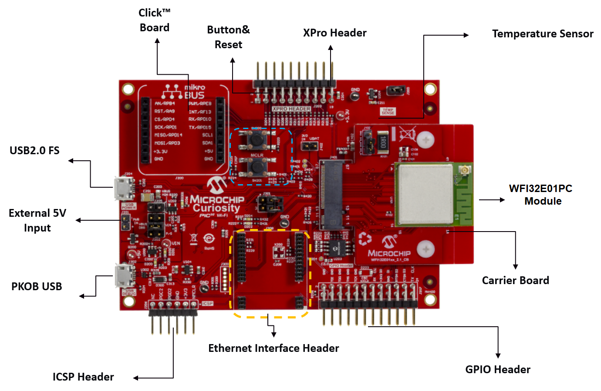
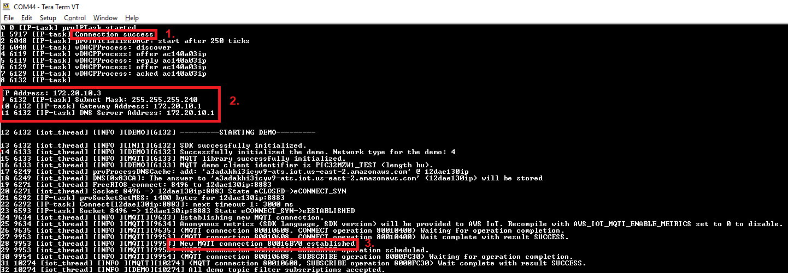

# Getting Started with the Microchip PIC32 WFI32E Curiosity Board

This tutorial provides instructions for getting started with the Microchip PIC32MZW1 Board.
Microchip provides two solutions with FreeRTOS

1. Secure Element based Wireless Solution with ECC608 Trust&Go
2. Wireless only solution (NVM Based).

Instructions are given separately for each of these two solutions, as they are quite different.  

## **1. OverView**
WFI32E01PC is a standalone and fully certified Wi-Fi module supporting 2.4 GHz 802.11 b/g/n radio modes. Specially designed for industrial IoT applications, WFI32E01PC contains the PIC32MZW1 series Wi-Fi SoC, which is a 200MHz high performance MCU with industrial leading Wi-Fi connectivity and rich peripheral options. PIC32MZW1 has 1MB embedded flash and 256KB SRAM, empowering embedded designers to rapidly build complex IoT software covering WLAN, TCP/IP stack, RTOS, Cloud connectivity, and application. Various types of peripherals, such as Ethernet, USB, ADC, CVD touch buttons, and CAN, make PIC32MZW1 a perfect system core to realize the most application features.

## **2.	Hardware Description**
### **2.1	DataSheet**  
[PIC32MZ1025W104 MCU and WFI32E01 Module with Wi-Fi® and Hardware-based Security Accelerator Data Sheet](https://ww1.microchip.com/downloads/en/DeviceDoc/PIC32MZ1025W104-MCU-and-WFI32E01-Module-with-Wi-Fi-and-Hardware-based-Security-Accelerator-Data-Sheet-DS70005425A.pdf)  
[PIC32 WFI32E Curiosity Board User's Guide](https://ww1.microchip.com/downloads/en/DeviceDoc/PIC32_WFI32E_Curiosity_Board_User's_Guide.pdf) 
### **2.2	Schematic** 
For PIC32 WFI32E Curiosity Board PCB schematics, see Section Appendix B of the [PIC32 WFI32E Curiosity Board User's Guide](https://ww1.microchip.com/downloads/en/DeviceDoc/PIC32_WFI32E_Curiosity_Board_User's_Guide.pdf). 

### **2.3 Key Components**
<p align="center">

</p> 

For a description of key components, jumper settings, LED descriptions and power requirements, see Section 3 in the [PIC32 WFI32E Curiosity Board User's Guide](https://ww1.microchip.com/downloads/en/DeviceDoc/PIC32_WFI32E_Curiosity_Board_User's_Guide.pdf)

### **2.4 Hardware requirements to run FreeRTOS demo**
#### **2.4.1 Standard Kit Contents**
- [PIC32 WFI32E Curiosity Board](https://www.microchip.com/DevelopmentTools/ProductDetails/PartNO/EV12F11A)
- Debugger/ Programmer   
[MPLAB PICkit4 In-Circuit Debugger](https://www.microchip.com/developmenttools/ProductDetails/PG164140)   
or   
[MPLAB ICD4 In-Circuit Debugger](https://www.microchip.com/DevelopmentTools/ProductDetails/DV164045) and [AC164110 - RJ-11 to ICSP Adapter](https://www.microchipdirect.com/product/search/all/AC164110?start=0&rows=50)
#### **2.4.2 3rd Party purchasable items**
- [MikroElectronika USB UART click Board](https://www.mikroe.com/usb-uart-click)

## **3. Set up your Development Environment**
**Note**

The FreeRTOS project for this device is based on MPLAB Harmony v3. To build the project, you need to use versions of the MPLAB tools that are compatible with Harmony v3, like v2.41 or higher of the MPLAB XC32 Compiler and the latest MPLAB IDE.

1. Install [Python version 3.x](https://www.python.org/downloads/) or later.
2. Install the MPLAB X IDE:
  - [MPLAB X Integrated Development Environment for Windows](http://www.microchip.com/mplabx-ide-windows-installer)
  - [MPLAB X Integrated Development Environment for macOS](http://www.microchip.com/mplabx-ide-osx-installer)
  - [MPLAB X Integrated Development Environment for Linux](http://www.microchip.com/mplabx-ide-linux-installer)
3. Install the MPLAB XC32 Compiler:
  - [MPLAB XC32/32++ Compiler for Windows](http://www.microchip.com/mplabxc32windows)
  - [MPLAB XC32/32++ Compiler for macOS](http://www.microchip.com/mplabxc32osx)
  - [MPLAB XC32/32++ Compiler for Linux](http://www.microchip.com/mplabxc32linux)
4. Start up a UART terminal emulator like TeraTerm and open the USB UART Click COM Port connection with the following settings:
  - Baud rate: 115200
  - Data: 8 bit
  - Parity: None
  - Stop bits: 1
  - Flow control: None

## **4. Set up your hardware** 

1. Connect the MikroElectronika USB UART click Board to the microBUS connector on the Microchip PIC32 WFI32E Curiosity Board.
2. Connect the MikroElectronika USB UART click Board to your computer using a USB A to USB mini-B cable.
<p align="center">

</p> 

3. Make sure that J202 jumper is connected to VBUS  
4. Make sure J301 jumpers are open (Pins 1-2 open, Pins 3-4 open)
5. To power supply the board , connect the USB Cable between USB Power J204 and your PC
6. Connect the MPLAB® ICD 4 tool or MPLAB PICKIT 4 between ICSP J206 connector and your PC, the detailed connection information can be found in the [PIC32MZW1 Software User Guide](https://ww1.microchip.com/downloads/en/DeviceDoc/PIC32MZ_W1_Software_User_Guide.pdf), Chapter 2.1.3 

## **5. Setup your AWS account and Permissions** 

To get started with FreeRTOS, you need an AWS account, an IAM user with permission to access AWS IoT and Amazon FreeRTOS cloud services, and you need one of the supported hardware platforms. You also need to download Amazon FreeRTOS and configure your board&#39;s Amazon FreeRTOS demo project to work with AWS IoT. The following sections walk you through these requirements.  

Refer to the instructions at https://docs.aws.amazon.com/freertos/latest/userguide/freertos-prereqs.html#freertos-account-and-permissions.  
Follow the steps:
1. Create and Activate an AWS Account.  If you already have an account, skip this step.
2. Add an IAM user to your AWS account
3. To attach the AmazonFreeRTOSFullAccess policy to your IAM user 
4. To attach the AWSIoTFullAccess policy to your IAM user.

## **6. Provision the device with AWS IoT**  

* For Wireless only solution (NVM Based)  
Refer to the instructions at https://docs.aws.amazon.com/freertos/latest/userguide/freertos-prereqs.html#freertos-account-and-permissions.  
Follow the steps under “Registering your MCU board with AWS IoT”.  The Quick Connect flow does not apply, so skip those instructions and follow the manual registration steps under the following headings:
    * To create an AWS IoT Policy
    * To create an IoT thing, private key, and certificate for your device

* For Secure Element based Wireless Solution with ECC608 Trust&Go  
Provision the Microchip Trust&Go Secure Element as per the following steps  

    **To obtain the device certificate**
    1. Follow above **Section 3. Set up your Development Environment** and **Section 4. Set up your hardware** to set up the hardware and development environment
    2. Open MPLAB IDE
    2. From the  **File**  menu, choose  **Open Project**.
    3. Browse to and open the project based on hardware selection  
    projects\microchip\curiosity2_pic32mzw1\mplab\tng_certificate_reader\firmware\tng_certificate_reader.X.
    4. Rebuild your project.
    5. On the Projects tab, right-click the tng_certificate_reader top-level folder, and then choose **Run**
    6. Connect the Curiosity Board to your PC through USB Power connector (J204) to power up the board
    7. The device enumerates as a mass storage device (MSD).
    8. Copy the ".cer" file from the MSD to your PC.  This is the pre-provisioned certificate file.

    **To configure IoT Thing**  
    1.  Browse to the AWS IoT console at console.aws.amazon.com/iot.
    2.  In the navigation pane on the left, choose Manage, and then choose Things.
    3.  If you do not have any IoT things registered in your account, the You don't have any things yet page is displayed. If you see this page, choose Register a thing. Otherwise, choose Create.
    4.  On the **Creating AWS IoT things page**, choose **Create a single thing**.
    5.  On the **Add your device** to the thing registry page, enter a name for your thing, and then choose Next.
    6.  On the **Add a certificate** for your thing page, choose **Create thing without certificate**.
    7.  In the navigation pane, choose **Secure**, choose **Policies**, and then choose **Create**.
    8.  Enter a name to identify your policy.
    9.  In the **Add statements** section, choose **Advanced mode**. Copy and paste the following JSON into the policy editor window. Replace *aws-region* and *aws-account* with your AWS Region and account ID.
        ```
        {
        "Version": "2012-10-17",
        "Statement": [
        {
            "Effect": "Allow",
            "Action": "iot:Connect",
            "Resource":"arn:aws:iot:aws-region:aws-account-id:*"
        }, 
        {
            "Effect": "Allow",
            "Action": "iot:Publish",
            "Resource": "arn:aws:iot:aws-region:aws-account-id:*"
        },
        {
            "Effect": "Allow",
            "Action": "iot:Subscribe",
            "Resource": "arn:aws:iot:aws-region:aws-account-id:*"
        },
        {
            "Effect": "Allow",
            "Action": "iot:Receive",
            "Resource": "arn:aws:iot:aws-region:aws-account-id:*"
        }
        ]
        }
        ```
    NOTE – all devices in your fleet must have credentials with privileges that authorize intended actions only, which include (but not limited to) AWS IoT MQTT actions such as publishing messages or subscribing to topics with specific scope and context. The specific permission policies can vary for your use cases. Identify the permission policies that best meet your business and security requirements.  
    For sample policies, refer to https://docs.aws.amazon.com/iot/latest/developerguide/example-iot-policies.html
    Also refer to https://docs.aws.amazon.com/iot/latest/developerguide/security-best-practices.html  
    10.  Choose **Create**.  
    11.  Navigate to **Certificates** > **Create a certificate**  
    12.  Select Create with **Get Started** under **Use my certificate**.  
    13.  In the next screen, click **Next** without making any selections.  
    14.  Click on **Select certificates**  
    15.  Select thies **.cer** file that you got in above steps when prompted to select a certificate.  
    16.  Select **Activate all** and click **Register certificates**  
    17.  Select the certificate and 
    *  Click **Attach policy** and select the policy that you created in above step 9
    *  Click **Attach thing** and choose the thing that you created in above step 5
  

## **7. Download FreeRTOS**

From the [MicrochipTech repository](https://github.com/MicrochipTech/amazon-freertos/tree/mchpdev/), download the amazon-freertos repository (mchpdev branch). 
 
To clone using HTTPS:
```
git clone https://github.com/MicrochipTech/amazon-freertos.git --recurse-submodules
```
Using SSH:
```
git clone git@github.com:MicrochipTech/amazon-freertos.git --recurse-submodules
```

If you have downloaded the repo without using the `--recurse-submodules` argument, you need to run:
```
git submodule update --init --recursive
```

---
**IMPORTANT**

The maximum length of a file path on Microsoft Windows is 260 characters. To accommodate the files in the FreeRTOS projects, make sure that the path to the Root pathbase freertos directory is fewer than 40 characters long.  
Long FreeRTOS download directory paths can cause build failures.

---


## **8. Configure FreeRTOS**

For Wireless only solution (NVM Based), refer [Configuring the FreeRTOS Demos](https://docs.aws.amazon.com/freertos/latest/userguide/freertos-configure.html). You need to configure AWS IoT endpoint and Wi-Fi credentials,and also the AWS IoT credentials  

For Secure Element based Wireless Solution with ECC608 Trust&Go, refer [Configuring the FreeRTOS Demos](https://docs.aws.amazon.com/freertos/latest/userguide/freertos-configure.html). You need to configure AWS IoT endpoint and Wi-Fi credentials, but no need to modify the AWS IoT credentials

## **Overview**

This tutorial contains instructions for the following getting started steps:

1. Connecting your board to a host machine.
2. Installing software on the host machine for developing and debugging embedded applications for your microcontroller board.
3. Cross compiling an Amazon FreeRTOS demo application to a binary image.
4. Loading the application binary image to your board, and then running the application.
5. Interacting with the application running on your board across a serial connection, for monitoring and debugging purposes.

## **9. Build and Run FreeRTOS Demo Project**

### Open the FreeRTOS Demo Project (MQTT Demo) in the MPLAB IDE

1. Open MPLAB IDE. If you have more than one version of the compiler installed, you need to select the compiler that you want to use from within the IDE.
2. From the  **File**  menu, choose  **Open Project**.
3. Browse to and open the project based on hardware selection:.

For Secure Element based Wireless Solution with ECC608 Trust&Go:

projects\microchip\curiosity2_pic32mzw1\mplab\aws_demos\firmware\aws_demos.X.

For Wireless only Solution:

projects\microchip\curiosity2_pic32mzw1_ecc\mplab\aws_demos\firmware\aws_demos.X.

**Note**

When you open the project for the first time, you might get an error message about the compiler. In the IDE, navigate to  **Tools** ,  **Options** ,  **Embedded** , and then select the compiler that you are using for your project. The demo kit comes with on-board EDBG debugger/programmer, which would be used for Programming/Debugging the Amazon FreeRTOS project.

### Run the FreeRTOS Demo Project

1. Rebuild your project.
2. On the  **Projects**  tab, right-click the aws\_demos top-level folder, and then choose  **Debug**.
3. When the debugger stops at the breakpoint in main(), from the  **Run**  menu, choose  **Resume**.

A successful run of the FreeRTOS MQTT Demo should have an output similar to the following in the serial console
```
0 0 [IP-task] prvIPTask started
1 5917 [IP-task] Connection success
2 6048 [IP-task] prvInitialiseDHCP: start after 250 ticks
3 6048 [IP-task] vDHCPProcess: discover
4 6119 [IP-task] vDHCPProcess: offer ac140a03ip
5 6119 [IP-task] vDHCPProcess: reply ac140a03ip
6 6129 [IP-task] vDHCPProcess: offer ac140a03ip
7 6129 [IP-task] vDHCPProcess: acked ac140a03ip
8 6132 [IP-task]

IP Address: 172.20.10.3
9 6132 [IP-task] Subnet Mask: 255.255.255.240
10 6132 [IP-task] Gateway Address: 172.20.10.1
11 6132 [IP-task] DNS Server Address: 172.20.10.1


12 6132 [iot_thread] [INFO ][DEMO][6132] ---------STARTING DEMO---------

13 6132 [iot_thread] [INFO ][INIT][6132] SDK successfully initialized.
14 6133 [iot_thread] [INFO ][DEMO][6132] Successfully initialized the demo. Network type for the demo: 4
15 6133 [iot_thread] [INFO ][MQTT][6133] MQTT library successfully initialized.
16 6133 [iot_thread] [INFO ][DEMO][6133] MQTT demo client identifier is PIC32MZW1_TEST (length hu).
17 6249 [iot_thread] prvProcessDNSCache: add: 'xxxxxxxxxxxxxxx-ats.iot.us-east-2.amazonaws.com' @ 12dae130ip
18 6249 [iot_thread] DNS[0x83CA]: The answer to 'xxxxxxxxxxxxxxx-ats.iot.us-east-2.amazonaws.com' (12dae130ip) will be stored
19 6271 [iot_thread] FreeRTOS_connect: 8496 to 12dae130ip:8883
20 6271 [iot_thread] Socket 8496 -> 12dae130ip:8883 State eCLOSED->eCONNECT_SYN
21 6292 [IP-task] prvSocketSetMSS: 1400 bytes for 12dae130ip:8883
22 6292 [IP-task] Connect[12dae130ip:8883]: next timeout 1: 3000 ms
23 6593 [IP-task] Socket 8496 -> 12dae130ip:8883 State eCONNECT_SYN->eESTABLISHED
24 9634 [iot_thread] [INFO ][MQTT][9633] Establishing new MQTT connection.
25 9634 [iot_thread] [INFO ][MQTT][9634] Anonymous metrics (SDK language, SDK version) will be provided to AWS IoT. Recompile with AWS_IOT_MQTT_ENABLE_METRICS set to 0 to disable.
26 9635 [iot_thread] [INFO ][MQTT][9635] (MQTT connection 80010608, CONNECT operation 80010400) Waiting for operation completion.
27 9953 [iot_thread] [INFO ][MQTT][9953] (MQTT connection 80010608, CONNECT operation 80010400) Wait complete with result SUCCESS.
28 9953 [iot_thread] [INFO ][MQTT][9953] New MQTT connection 80016B70 established.
29 9953 [iot_thread] [INFO ][MQTT][9953] (MQTT connection 80010608) SUBSCRIBE operation scheduled.
30 9954 [iot_thread] [INFO ][MQTT][9954] (MQTT connection 80010608, SUBSCRIBE operation 8000FC30) Waiting for operation completion.
31 10274 [iot_thread] [INFO ][MQTT][10274] (MQTT connection 80010608, SUBSCRIBE operation 8000FC30) Wait complete with result SUCCESS.
32 10274 [iot_thread] [INFO ][DEMO][10274] All demo topic filter subscriptions accepted.
33 10274 [iot_thread] [INFO ][DEMO][10274] Publishing messages 0 to 1.
34 10274 [iot_thread] [INFO ][MQTT][10274] (MQTT connection 80010608) MQTT PUBLISH operation queued.
35 10275 [iot_thread] [INFO ][MQTT][10275] (MQTT connection 80010608) MQTT PUBLISH operation queued.
36 10275 [iot_thread] [INFO ][DEMO][10275] Waiting for 2 publishes to be received.
37 10593 [IP-task] win_tx_ack: acked 1840 expc 1840 len 64
38 10593 [IP-task] win_tx_ack: acked 1840 expc 1840 len 64
39 10593 [iot_thread] [INFO ][DEMO][10593] MQTT PUBLISH 0 successfully sent.
40 10594 [iot_thread] [INFO ][DEMO][10594] Incoming PUBLISH received:
Subscription topic filter: iotdemo/topic/1
Publish topic name: iotdemo/topic/1
Publish retain flag: 0
Publish QoS: 1
Publish payload: Hello world 0!

```

### Monitoring MQTT Messages on the Cloud

You can use the MQTT client in the AWS IoT console to monitor the messages that your device sends to the AWS Cloud.

**To subscribe to the MQTT topic with the AWS IoT MQTT client**

1. Sign in to the [AWS IoT console](https://console.aws.amazon.com/iotv2/).
2. In the navigation pane, choose  **Test**  to open the MQTT client.
3. In  **Subscription topic** , enter  **iotdemo/#** , and then choose  **Subscribe to topic**. 
This will enable you to see the periodically published messages by the MQTT Hello World example.

## **10. Troubleshooting**

If no messages appear in the AWS IoT console, try the following:
1. Open a terminal window to view the logging output of the sample. This can help you determine
what is going wrong.

2. Below picture shows the highlighted debug log
    * If log1 is not print, check that your Wi-Fi credentials are valid
    * If log2 is not print, check that your AP settings are correct
    * If log3 is not print, check that your AWS IoT credentials are valid

<p align="center">

</p> 

For general troubleshooting information about Getting Started with FreeRTOS, see [Troubleshooting Getting Started](https://docs.aws.amazon.com/freertos/latest/userguide/gsg-troubleshooting.html).


